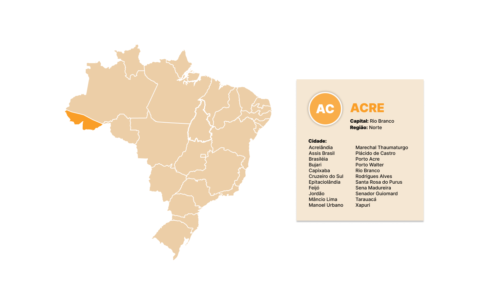

# Mapa de Estados do Brasil

> Segue o link para o _[Prótotipo Figma](https://www.figma.com/file/FjsiJ31HpyWceTFqmbYvK2/mapa?node-id=1-2&t=s635IdgvxOiJWpU2-0)_

## Objetivo
 O intuito desse projeto é, além de aprender a lidar com **imagens svg** no desenvolvimento de sites, também o de exercitar o uso de APIs e endpoints no desenvolvimento do mesmo.  

## Tecnologias Utilizadas

* HTML 
* CSS
* JavaScript
* Postman
* Figma

## Autora
***[Daniela Lino](https://github.com/D4kii)***
